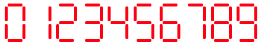
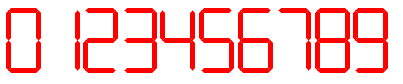

# A Seven Segment Display Component for Vue.js

<p align="center">
  
</p>

<p align="center">
  
</p>

### Installation

```
npm install --save vue-seven-segment-display
```

### Registration

main.js

```
import Vue from 'vue';
import SevenSegmentDisplay from 'vue-seven-segment-display';

Vue.use(SevenSegmentDisplay);

new Vue({
  ...
});
```

### Usage

Sample.vue

```  
<seven-segment value="8" :rounded="true" :segment-width="25" :segment-height="5" on-color="#f00" off-color="transparent"/>
```

`value` or `:value`
- Any Number between 0-9 in String format. Default is "8"
- Use `:value={myValue}` to bind `value` prop to `myValue`

`:rounded`
- Boolean. Default is true.
- True makes segments appear rounded, false makes it appear pointy

`:segment-width`
- Number. Default is 25
- Width of a segment
  
`:segment-height`
- Number. Default is 5
- Height of a segment
  
`on-color`
- String. Default is `#f00`
- Color when segment is on.

`off-color`
- String. Default is `transparent`
- Color when segment is off.
